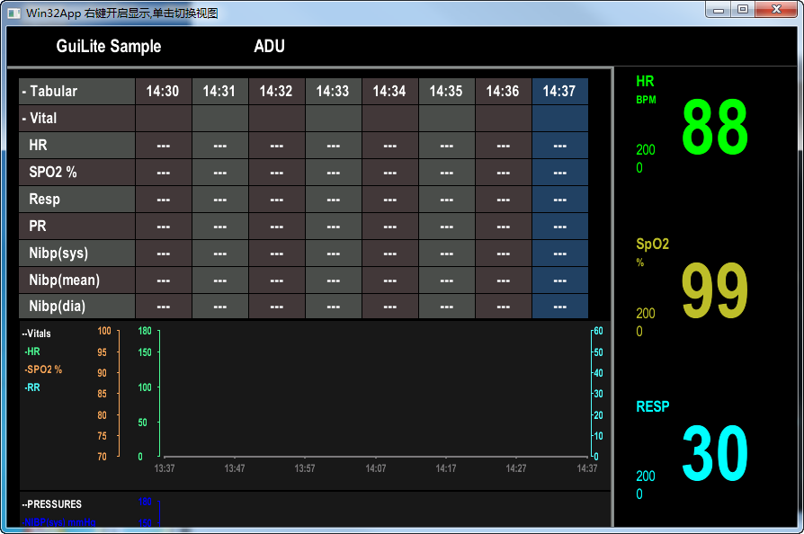

GuiLite

Fork [GuiLite](https://github.com/idea4good/GuiLite) [ReadMe](README_ORG.md)

Build UI framework for all platform with 6,000 lines code

---

合并GuilLite和sample为一个项目。

---

原理：
  动态生成一张bmp位图，给适配器去显示。

---

代码风格：
  部分C语言的接口使用extern导出，未导出.h头文件。
  
---
 
 底层调用最多的函数
 
····c

 void c_surface_16bits::set_pixel(int x, int y, unsigned int rgb, unsigned int z_order)

···

以下函数，循环调用生成数据

`c

static DWORD WINAPI fire_real_timer(LPVOID lpParam)
{
	char dummy;
	while(1)
	{
		if(s_real_timer_fifo.read(&dummy, 1) > 0)
		{
			if(s_expire_function)s_expire_function(0);
		}
		else
		{
			ASSERT(FALSE);
		}
	}
	return 0;
}

// 调用
static void real_timer_routine(void* arg)

`

 
---

看了win32下的sample，运行机制是打开一个定时刷新的网页去加载本地图片。

就是图片要50毫秒写一次到硬盘，表示不理解。肯定不能这样处理。

---

移植sample为win32的GUI程序。

修改说明：

底层修复：GuiLite\core\src\adapter\api_win.cpp

1、添加了回调函数和全局句柄，用于win32的界面显示

2、 int build_bmp(char *filename, unsigned int width, unsigned int height, unsigned char *data)
中判断回调函数不为空的时候调用win32的界面绘制。

3、存在回调函数式，图片直接写入到内存，不经过硬盘。添加了类CMemoryBmp用于写入bmp文件。
并将位图转换为HBITMAP供窗口使用。

4、添加切换接口SetActiveSlide，用于切换视图。

5、底层的消息是回调的，为了避免线程操作UI使用了PostMessage。

6、底层算法的CPU使用率过高，这里将LOOP_SNAPSHOT_INTERVAL的数值由50设置为500。CPU占用下降了点，但是还是很高。

---

优化建议：

1、数据转为位图的生成最占时间，算法可优化。可采用移动法，每次只生产前面几列，
类似水管，左边进，右边出，中间的数据不变。使用区域化刷新机制。

2、在win32位下统一使用bmp 32bit模式，不使用16bit模式。

